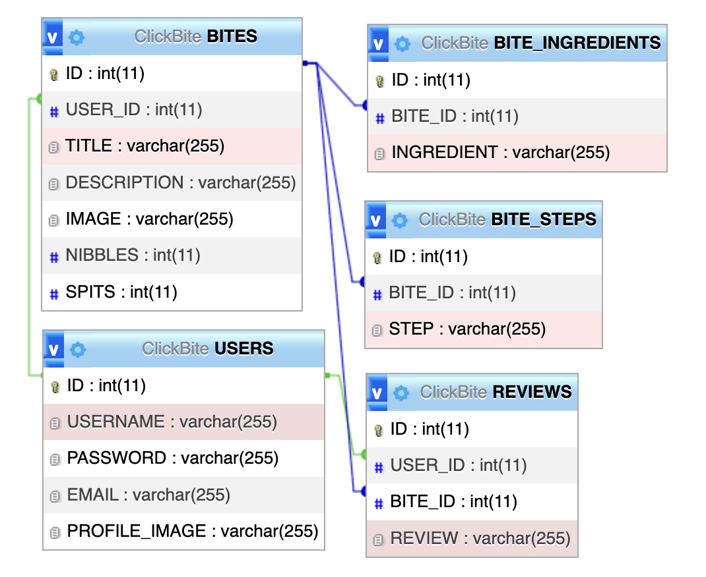

# Milestone Project: ClickBite 

- Author: Scott Maxwell
- Course: CST-391: JavaScript Web Application Development

## Project Description

ClickBite aims to be a one stop shop for obtaining and distributing free recipes to help individuals cook at home. While posting will require signing up, viewing them will not. Posts are called "bites." Users can like posts which are called "nibbles."  Users can also dislike posts which are called "spits." The site will have no life-story policy when it comes to posts. The description of each meal will be limited to 300 characters.

The following stack will be used:

- [MySQL](https://www.mysql.com/) - Database Management System
- [ExpressJS](https://expressjs.com/) - API that accesses Database
- [Angular](https://angular.io/) - Model-View-ViewModel
- [React](https://react.dev/) - JavaScript library for building interactive user interfaces

## Functionality Requirements (User Stories):

- As a typical person, I do not desire to read about someone's life story before I get to the instructions on how to cook the meal.
- As a body building enthusiast, I desire an accessible site that provides nutritional facts regarding the meal I am cooking.
- As someone who has a hard time with bright light, I desire the site to include a dark mode so that there is less strain on my eyes.
- As someone who looks up recipes in the kitche, I would like the site to be mobile friendly.
- As someone who likes cooking specific foods, I would like to use a search feature to find specific meals.
- As a picky eater, I would like the recipes to have a rating system so I can pick from better

## Initial Database Design: ER Diagram

## Initial UI Sitemap: Logical layout and flow of application pages/modules

## Initial UI Wireframes: Low-fidelity user interface designs.

(Click to see larger)

 

## Initial UML Classes: The back-end services and object model class designs.

## Risks

- Unsure how to secure Express API and Angular App
- Unsure how MySQL will scale long-term

