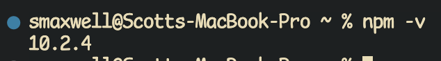
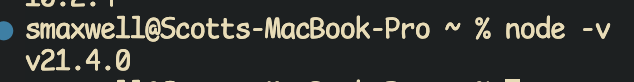
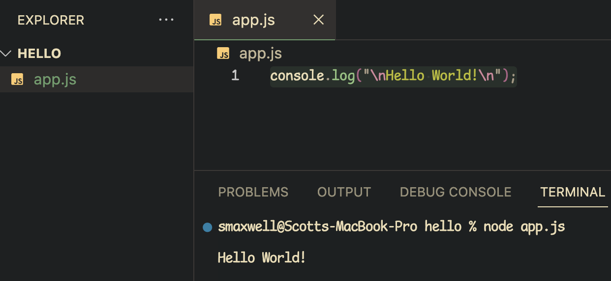
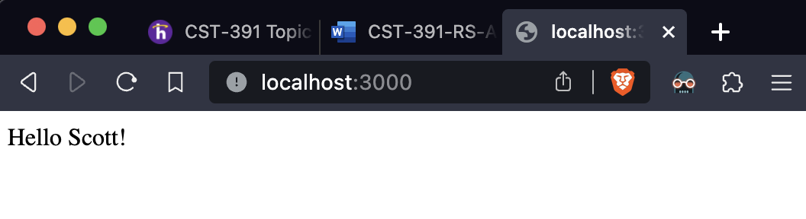
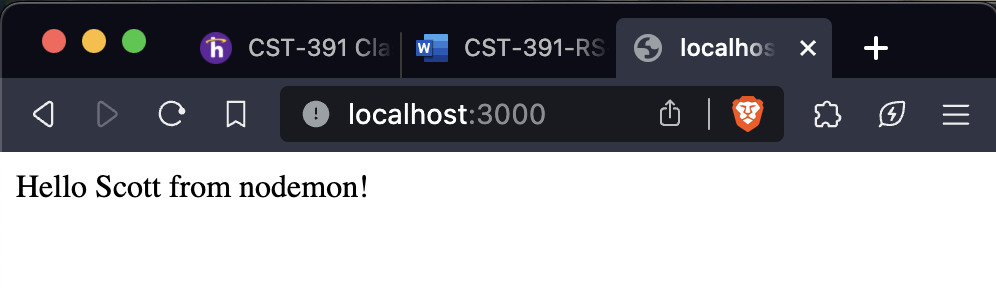
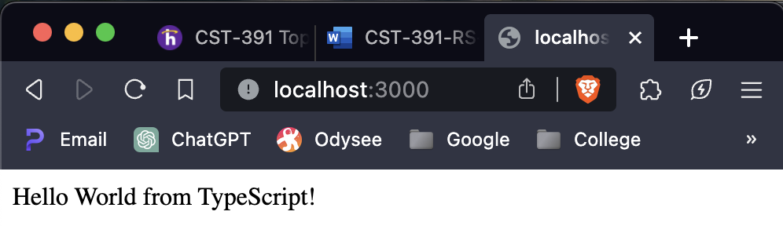
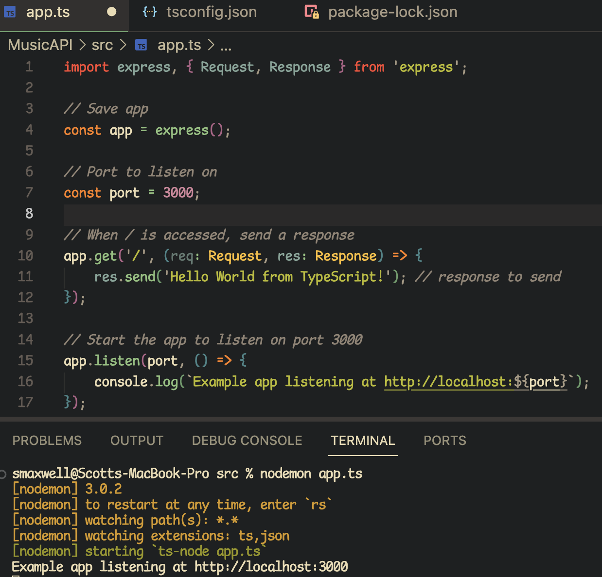

# Activity 0: Tools Installation and Initial Applications

## Part 1: Tools Installation and Hello World

Description: The above screenshot shows the version of npm (Node Package Manager) that is in use.

----

Description: The above screenshots shows the version of nodeJS that is in use.

----

Description: The above is a simple Hello World JavaScript program.

----

Description: The above screenshot shows the Node Server running.

----

Description: The above screenshot shows the Server running via Nodemon.

----

## Part 2: Node.js with TypeScript

Description: The above shows the server running after compiling TypeScript to JavaScript using the `ts-node` command.

----

Description: The above screenshot shows the TypeScript code for the node server along with the `nodemon` command being used to compile the TypeScript to JavaScript.

